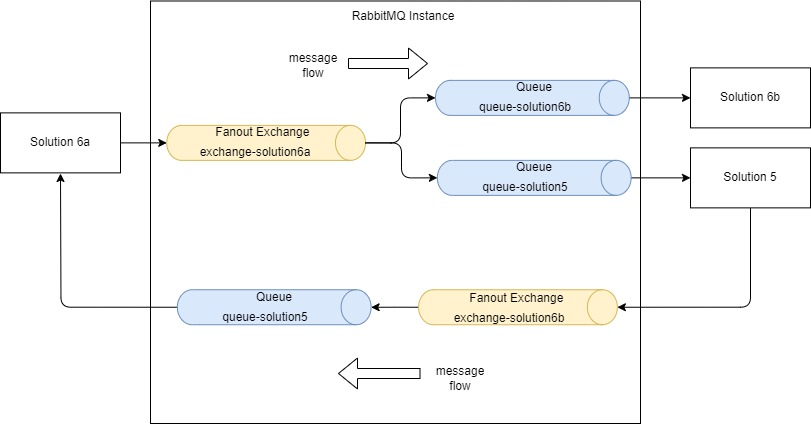

# Demo RabbitMQ and fanout exchange pattern

## Description

This is a simple demo of RabbitMQ and fanout exchange pattern. 



## Prerequisites

- Java 8 or higher installed
- Maven installed

Alternatively if you already have IntelliJ IDEA installed, you can open the project in IntelliJ IDEA and build the project from there using the built-in Maven tool.

- Docker installed

## Install RabbitMQ using Docker

Run the following command to install RabbitMQ using Docker:

Pull official RabbitMQ image from Docker Hub:
```bash
docker pull rabbitmq:3-management
```
Run the RabbitMQ container:
```bash
docker run -d --hostname my-rabbit --name some-rabbit -p 8080:15672 -p 5672:5672 rabbitmq:3-management
```

or if container was previously created and stopped:
```bash
docker start some-rabbit
```

(Optional) Access RabbitMQ management console by navigating to http://localhost:8080/ . The default username and password are `guest`.


## Demo explained

Program demonstrate the fanout pattern with one producer sending a JSON file and multiple consumers reading the JSON file. For demo purposes, the JSON file is located in the root of the project and is named `data.json`.

Message Flow: A producer sends a message to an exchange. The exchange then routes the message to one or more queues based on its type and binding rules. Consumers then pull messages from these queues:

    Producer → Exchange → Queue → Consumer

Consumer queues are set as durable so if consumer is not available, the message will be stored in the queue and will be delivered when the consumer is available. 

For this demo queue is created automatically when the consumer starts first time.

## Building the project

Navigate to the root of the project and run the following command to build the project:

```bash
mvn clean package
```

This will create a jar file in the `target` directory.

Or if you are using IntelliJ IDEA, you can build the project by clicking on the `Build` menu and selecting `Build Project`.

## Running the demo

We will start multiple consumers and one producer.

### Start consumers

Open a terminal and navigate to the root of the project. Run the following command to start the consumers:

```bash
java -cp target/demo-rabbitmq-1.0-SNAPSHOT.jar demo.fanout.FanoutConsumer solution1_queue
```

Repeat above to start multiple consumers. Each consumer will be started in a separate terminal. Each consumer will start with a differnt queue name. 

```bash
java -cp target/demo-rabbitmq-1.0-SNAPSHOT.jar demo.fanout.FanoutConsumer solution2_queue
```

### Start producer

Open another terminal and navigate to the root of the project. Run the following command to start the producer:

```bash
java -cp target/demo-rabbitmq-1.0-SNAPSHOT.jar demo.fanout.FanoutProducer
```

The producer will read the `data.json` file and send the JSON data to the default exchange 'fanout_exchange' hardcoded in the producer code. The consumers will read the JSON data from the queue and print it to the console. The timestamp attribute in json document will be changed by the producer each time a message is sent.

The producer will stop after sending the JSON data. The consumers will continue to run and wait for more messages. 

If you want to send more messages, you can start the producer again. 

If consumers are not running and you start the producer, the messages will be stored in the queue and will be delivered when the consumers are started (assuming consumer was started at least once bevore so that it had a chance to create the queue). 

You can log in to the RabbitMQ management console to see the exchanges, queues, and messages. 


